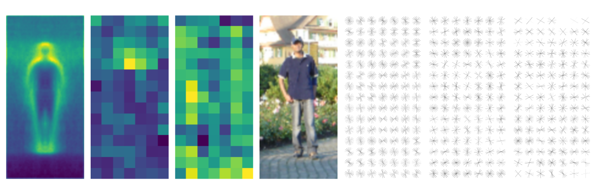
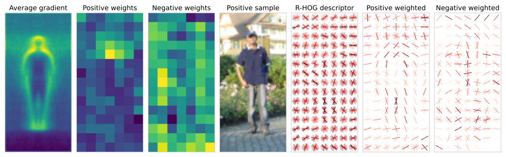
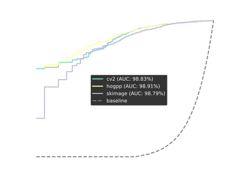
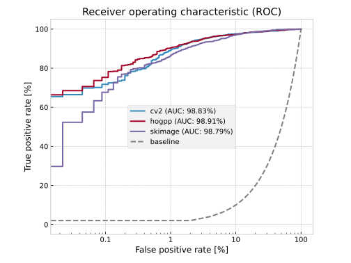
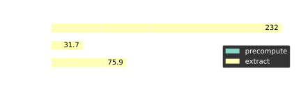
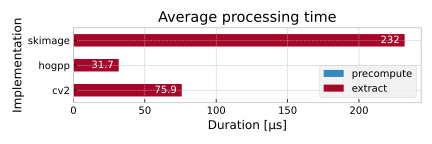

.. _inria-performance:

Performance on the INRIA Person Dataset
=======================================

HOGpp implementation was validated by applying it to the task of pedestrian
detection. For the most part, the experiments by Dalal & Triggs were replicated
with few alterations.

More specifically, we trained a linear support vector machine (SVM) in the
primal using stochastic gradient descent (SGD) on features extracted from
`cropped annotations
<https://github.com/sergiud/pascal-annotation-v1-extractor>`__ of the INRIA
person dataset. We then quantitatively compared the performance of the obtained
classifier against models trained on descriptors extracted using `OpenCV
<https://docs.opencv.org/4.10.0/d5/d33/structcv_1_1HOGDescriptor.html>`__ and
`scikit-image
<https://scikit-image.org/docs/0.24.x/api/skimage.feature.html#skimage.feature.hog>`__.

The following figure provides an intuition of the steps involved in training a
pedestrian classifier and its use on HOG features for predicting the
corresponding class.

On a high level, HOG features describe the silhouette of a pedestrian which is
eventually used in a way that is similar to how template matching works albeit
accounting for some pose variations.

Training
--------

For comparison purposes, we trained all the classifiers using same fixed set of
HOG parameters producing a 3780-dimensional feature vector. Specifically, the
parameters employed were:

-  9 orientation bins constructed from ``unsigned`` gradients
-  cell size of 8×8 pixels
-  overlapping blocks consisting of 16×16 pixels (or equivalently, 2×2 cells)
-  ``l2-hys`` block normalization clipped at 0.2

We then trained an initial SVM classifier using 5-fold stratified inner
cross-validation while optimizing the regularization term penalty using grid
search. 20% of the samples of each training split were additionally used as a
validation split to allow for early stopping.

After obtaining the initial model, we used each classifier to perform an
exhaustive search for false positives (i.e., hard mining) and retrained the
classifiers by including the hard mined samples.

We used confidence based sampling opposed to random sampling to subsample the
large set of false positives. Specifically, up to 30 most confident false
positives (i.e., samples farthest away from the decision boundary) were selected
as hard negatives.

.. _inria-quantitative-results:

Quantitative Results
--------------------

The following plot summarizes the performance of refined models at various
thresholds.

Overall, the HOGpp based model outperforms models that use OpenCV and
scikit-image HOG descriptors.

A detailed look at additional classification metrics, however, shows that HOGpp
achieves a lower precision compared to other two implementations. Yet, the
recall and consequently the F₁ score are considerably higher thereby
outperforming both implementations.

.. table:: Classification metrics of different HOG implementations

   +----------------+-------------+-------------+-------------+-------------+
   | Implementation | Precision   | Recall      | F₁ score    | Accuracy    |
   +================+=============+=============+=============+=============+
   | hogpp          | 95.45%      | **90.75%**  | **93.04%**  | **97.20%**  |
   +----------------+-------------+-------------+-------------+-------------+
   | skimage        | 96.95%      | 83.53%      | 89.74%      | 96.06%      |
   +----------------+-------------+-------------+-------------+-------------+
   | cv2            | **98.32%**  | 79.46%      | 87.89%      | 95.48%      |
   +----------------+-------------+-------------+-------------+-------------+

Hard Negatives
^^^^^^^^^^^^^^

It is also important to consider the number of hard negatives produced by each
of the HOG descriptor implementations. The following table provides an overview
of the corresponding absolute numbers.

.. table:: Absolute number of hard negatives obtained by various HOG
   implementations

   ============== ==============
   Implementation Hard negatives
   ============== ==============
   hogpp          **30584**
   cv2            31113
   skimage        33433
   ============== ==============

In this specific application, the initial model obtained from HOGpp descriptors
generates the least number of false positives usable for further refinement.
While the overall number of training samples is lowest, the HOGpp model still
achieves the best performance in terms of the F₁ score and ROC AUC. At the same
time, this indicates that the initial HOGpp model already generalizes better
than OpenCV and scikit-image based models.

Due to the probabilistic nature of the learning process, particularly the number
of hard negatives can vary depending on the chosen seed. Therefore, the
corresponding numbers should be taken with a grain of salt because at times the
OpenCV based model can produce fewer hard negatives than HOGpp. This
observation, however, does not affect the generalization ability of the refined
models on this task.

Runtime Performance
^^^^^^^^^^^^^^^^^^^

The following bar plot summarizes the average runtime of individual HOG
implementations for extracting the descriptor of a single 128×64 (height×width)
region of interest (ROI) within a larger image as performed during hard mining.

The runtime of the ``precompute`` stage applicable only to HOGpp is negligible
and can therefore be hardly observed in the bar plot. As such, the ``extract``
stage is computationally more expensive. Nevertheless, HOGpp outperforms both
implementations in terms of the average cumulative runtime for a single ROI
consuming around 32 μs.

The speed up factor achieved by HOGpp with respect to OpenCV and scikit-image
implementations is as follows:

.. table:: HOGpp speed up

   ===== ==== =======
   \     cv2  skimage
   ===== ==== =======
   hogpp ×2.4 ×7.3
   ===== ==== =======

Final Remarks
-------------

As always, the provided results are specific to the described experiment,
environment, and the setup used to evaluate the models, and therefore should not
be extrapolated to different tasks without validation.
